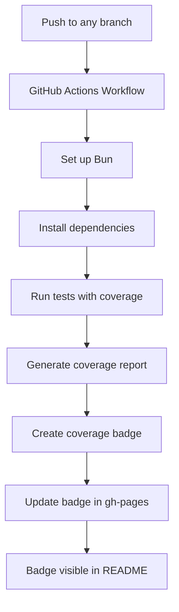

# GitHub Workflow Implementation Plan

## Project Overview
- **Project**: duidjs - A TypeScript library for handling money operations with precision using BigInt
- **Testing Framework**: Bun's built-in test runner
- **Current CI/CD**: There's an existing workflow for npm publishing on release

## Requirements
1. Create a GitHub workflow that runs tests for all push branches
2. Use Bun's built-in test runner with the `--coverage` flag
3. Generate a code coverage badge for the README using the coverage-badge-action

## Implementation Plan

### 1. Create GitHub Workflow File

We'll create a new workflow file `.github/workflows/test.yml` that will:
- Trigger on all push events
- Set up Bun
- Install dependencies
- Run tests with coverage
- Generate a coverage badge

### 2. Configure Bun Test Coverage

We'll use Bun's built-in coverage capabilities with the `--coverage` flag and configure it to output in a format that can be used by the coverage badge action.

### 3. Set Up GitHub Pages (if not already set up)

The coverage badge action requires GitHub Pages to be enabled for the repository to host the badge SVG file.

### 4. Add Coverage Badge to README

We'll add the coverage badge to the README.md file.

## Workflow Diagram



## Detailed Steps

### Step 1: Create the GitHub Workflow File

Create a new file `.github/workflows/test.yml` with the following content:

```yaml
name: Run Tests

on:
  push:
    branches: [ '*' ]
  pull_request:
    branches: [ main ]

jobs:
  test:
    runs-on: ubuntu-latest
    steps:
      - name: Checkout code
        uses: actions/checkout@v3

      - name: Setup Bun
        uses: oven-sh/setup-bun@v1
        with:
          bun-version: latest

      - name: Install dependencies
        run: bun install

      - name: Run tests with coverage
        run: bun test --coverage --coverage-reporter=lcov

      - name: Update Coverage Badge
        uses: we-cli/coverage-badge-action@main
```

### Step 2: Configure GitHub Pages (if needed)

1. Make sure GitHub Pages is enabled for the repository
2. Configure it to use the gh-pages branch
3. Give the workflow permission to write to the repository

### Step 3: Add Coverage Badge to README

Add the following line to the README.md file:

```markdown

```

## Considerations and Alternatives

1. **Coverage Thresholds**: We could add coverage thresholds to ensure code quality by adding a `bunfig.toml` file with:
   ```toml
   [test]
   coverageThreshold = 0.8  # 80% coverage required
   ```

2. **Alternative Badge Generators**: If the we-cli/coverage-badge-action doesn't work well with Bun, we could explore other options like:
   - Creating a custom script to parse the coverage report and generate a badge
   - Using another badge generator that supports lcov format

3. **Caching**: For larger projects, we might want to add caching of dependencies to speed up the workflow:
   ```yaml
   - name: Cache dependencies
     uses: actions/cache@v3
     with:
       path: ~/.bun/install/cache
       key: ${{ runner.os }}-bun-${{ hashFiles('**/bun.lockb') }}
       restore-keys: ${{ runner.os }}-bun-